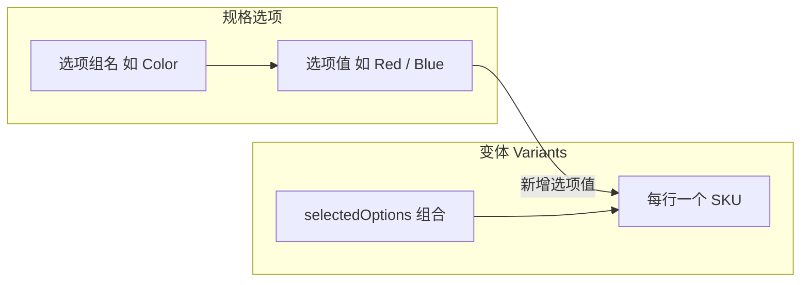

# 商品详情（新建与编辑）

> **新建**：`/_Admin/commerce/product-management/create?SiteId=...&typeId={类型Id或空白}`  
> **编辑**：`/_Admin/commerce/product-management/edit?SiteId=...&id={商品Id}`

在列表页 [创建商品](./product-management.md) 或点 **编辑** 后进入的全屏表单，自上而下分为 **基本信息**、[自定义字段](#自定义字段)（若有）、**规格选项与变体**（未隐藏规格时）。保存后返回 [商品管理列表](./product-management.md)。

::: tip 与列表的关系
| 页面 | 文档 |
|------|------|
| 列表、筛选、复制、批量删除 | [商品管理（列表）](./product-management.md) |
| 本条表单 | 本文 |
:::

## 如何进入

| 方式 | 路由 |
|------|------|
| **新建** | 列表 **创建商品** → 选「空白商品」或某一 **商品类型** → `product-management/create?typeId=...` |
| **编辑** | 列表行内编辑 → `product-management/edit?id=...` |

面包屑一般为：**商品管理 → 编辑商品**（新建时标题为创建类文案，以界面为准）。

页面底部固定 **取消 / 保存 / 保存并返回**（`KBottomBar`），与内容条目编辑类似。

## 基本信息

第一块白底卡片（`BasicInfo`）。多语言站点右上角有 **多语言** 切换，下列字段可在默认语言与各语言间分别维护。

<DocImage src="/cms/commerce/product-management-detail-basic.png" alt="商品详情：基本信息区（名称、SEO、图片、描述、分类、标签、上架）" width="1120" />

| 字段 | 说明 |
|------|------|
| **产品名称**（`title`） | 必填；前台展示用标题。多语言时除默认 `title` 外，各语言写在 `customData.title` |
| **SEO 名称**（`seoName`） | 必填；用于友好 URL。不可含 `[]\{}#%^*+=_\|~<>.?!'"/:;,()$&@` 及空白等字符；站内须唯一。输入框旁可据标题生成建议值（`SeoName` 组件，`path=product`） |
| **图片**（`images` / `featuredImage`） | 从 [媒体库](/cms/site/media.md) 选图；可设 **主图**（`featuredImage`）。图集与主图元数据写入 `imageMetas` |
| **描述**（`description`） | 富文本（`KEditor`）；多语言结构同标题 |
| **分类**（`categories`） | 标签展示已选分类；绿色 **+** 打开选择对话框，关联 [商品分类](./product-categories.md)。手动分类可点标签上删除 |
| **标签**（`tags`） | 可输入新标签或从已有商品标签中选择 |
| **上架**（`active`） | 开关：是否在 storefront 作为可售商品 |

字段 **显示名** 可在 [商品类型](./product-types.md) / [设置](./settings.md) 的 **商品自定义字段** 中配置（系统字段如 Title、SeoName 等）。

### 属性（可选）

当 [设置](./settings.md) **未** 开启「隐藏属性」时，基本信息卡片底部多一行 **属性**：键值对列表（`KeyValueEditor`），用于补充商品级属性，与下方规格维度无强制一一对应，按需填写。

## 自定义字段

[设置](./settings.md) 里配置的 **商品自定义字段**（非系统字段）由 `CustomData` 渲染，出现在基本信息与规格区块之间；字段类型可为文本、选择、图片等，并支持 [商品类型](./product-types.md) 上的动态选项。无自定义字段时该块不显示。

## 规格选项如何影响变体

当 [设置](./settings.md) **未** 开启「隐藏规格」时，页面下方第二块区域包含 **规格选项**（`OptionGroupEditor`）与 **变体表格**（`VariantEditor`）。二者共同决定前台可选的 SKU。

要点（与 `product-variant.ts` 行为一致）：

| 操作 | 对变体的影响 |
|------|----------------|
| **新增选项组** | 点 **+** 增加空选项组；需填写选项名（如 `Size`）与至少一个选项值后，变体行才按该维度展开 |
| **为已有组新增选项值** | 系统会为 **尚未包含该取值** 的现有变体 **复制** 出新行（组合不重复）；已有组合不变 |
| **重命名选项组 / 选项值** | 同步更新所有变体 `selectedOptions` 中对应 `name` / `value` |
| **删除某个选项值** | 若仍存在其它变体持有该维度的其它值，则 **删除** 使用该取值的变体行；若该维度只剩这一种取值，则从各行中 **去掉该维度** |
| **删除整个选项组** | 从所有变体中移除该维度，并清理相关行 |
| **添加规格**（按钮） | 在已定义选项组的前提下，手动新建一行 SKU，在弹窗中为每个维度选值（不可与已有组合重复） |

每个 **变体** 对应一条可单独定价、库存、上架的 SKU；`selectedOptions` 为 `{ name, value }[]`，例如 `Color: Red` + `Size: M`。前台加购时按所选组合匹配变体。

## 规格选项

`OptionGroupEditor`：每个选项组一张卡片，可折叠编辑。

<DocImage src="/cms/commerce/product-management-detail-variant-options.png" alt="规格选项：选项组名、文本或颜色类型、选项值列表" width="1120" />

| UI | 说明 |
|----|------|
| 选项组标题 | 点击卡片进入编辑：填写 **选项名**（如 Color、Size） |
| 类型 | 选项组可为 **文本** 或 **颜色**；颜色类型用取色器维护取值 |
| 选项值 | 逐条输入；回车或 Tab 可继续添加。展示态下各值可带小图（写入 `variantOptions.items[].image`） |
| 多语言 | 多语言开启时，卡片上 **语言** 图标可编辑该选项组与各选项值的译文 |
| **完成** | 结束当前组编辑；**删除** 图标可移除整组（并触发上文变体联动逻辑） |
| 底部 **+** | 新增一个选项组 |

选项定义同时写入商品的 `variantOptions`（含类型、多语言、每项元数据），并与变体表格中的 **选项** 列展示联动。

## 变体列表

规格选项下方为变体表格；至少有一个选项组且首行变体已带 `selectedOptions` 时，表格上方出现 **添加规格**（界面文案，即手动新建变体 SKU）。

<DocImage src="/cms/commerce/product-management-detail-variants.png" alt="变体表格：图片、选项组合、价格、库存、销量、上架、行内操作" width="1120" />

| 列 / 操作 | 说明 |
|-----------|------|
| **图片** | 变体主图；可换图。若 [设置](./settings.md) 为 Images 配置了 meta 模板，可编辑图片元数据 |
| **选项** | 当前行 `selectedOptions` 的组合展示（如 `Red / M`） |
| **价格** | 该 SKU 售价（货币符号取自 [设置](./settings.md)） |
| **库存** | `newInventory`：本次保存将写入的库存增量/目标值（与 `originalInventory` 配合，以接口为准） |
| **销量** | 只读统计 |
| **数字交付项** | 仅 **数字商品** 类型显示；配置可下载文件，见 [配送](./shippings.md) |
| **上架** | 该 SKU 是否可售 |
| **编辑** | 打开 [编辑变体弹窗](#编辑变体弹窗) |
| **删除** | 变体多于一行时可删 |

::: warning 数字商品交付项
若设置中开启 **数字商品交付项必填**，且商品为数字类型，每个变体须配置交付项后才能保存。
:::

## 编辑变体弹窗

点击表格行 **编辑** 打开 编辑变体弹窗

<DocImage src="/cms/commerce/product-management-detail-variant-dialog.png" alt="编辑变体弹窗：大图、各维度取值、价格重量库存 SKU 等" width="460px" />

| 项 | 说明 |
|----|------|
| 变体图 | 大图区，默认可沿用商品主图 |
| **规格选项** | 每个维度一行：`名称`（只读）+ `值`（下拉，候选来自同商品其它变体该维度的已有取值） |
| **价格 / 重量 / 库存** | 数字输入 |
| **SKU / 条码** | 文本 |
| **标签** | 变体级标签（与商品标签独立） |
| **上架** | 该 SKU 开关 |

确认后写回表格对应行；若修改了某维度取值，会同步更新 `variantOptions` 中对应项名称。

## 添加规格弹窗

点 **添加规格** 打开弹窗（弹窗标题多为 **创建**），结构与编辑弹窗相同，但各维度 **值** 需重新选择（初始为空）。保存后将新行追加到表格；未选图时使用商品 **主图**。

<DocImage src="/cms/commerce/product-management-detail-variant-create-dialog.png" alt="添加规格弹窗：为每个规格维度选择取值" width="460px" />

组合不得与已有变体重复；各维度下拉选项来自当前商品已出现的取值集合。

## 底部操作栏

| 按钮 | 说明 |
|------|------|
| **取消** | 返回列表，不保存 |
| **保存** | 校验基本信息与自定义字段后提交；数字商品校验交付项（若开启必填） |
| **保存并返回** | 保存成功后回到 [列表](./product-management.md) |

## 相关

- [商品管理（列表）](./product-management.md)  
- [商品类型](./product-types.md)  
- [电商设置](./settings.md)  
- [配送](./shippings.md)（实体 / 数字商品）
