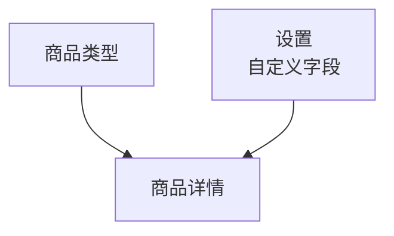

# 商品类型

> 菜单：**电商 → 商品类型**  
> 深链：`/_Admin/commerce/product-types?SiteId={站点GUID}`

**商品类型**定义一类商品在后台的 **属性模板** 与 **规格选项预设**（类似 [内容 → 数据类型](../content/content-types.md) 定义条目结构，但商品类型的「表单字段」主要来自 [设置](./settings.md) 中的 **商品自定义字段**，全局共用）。类型还决定是否按 **数字商品** 处理下载限制。

::: warning 须先于商品
未创建类型时，[商品管理](./product-management.md) 的 **创建商品** 下拉除「空白商品」外无可用类型。至少先建一种（如实体商品、数字商品）。

商品级 **标题、描述、规格变体** 等在 [商品详情](./product-management-detail.md) 维护；类型保存的是 **模板**，新建商品时按所选 `typeId` 预填属性与规格维度。
:::

## 如何打开

1. 在 [编辑菜单](../navigation.md#权限与编辑菜单) 中勾选 **电商 → 商品类型**（及父级 **电商**）。
2. 左侧 **电商 → 商品类型**。

## 列表页

路径：`/_Admin/commerce/product-types?SiteId=...`

| 列 / 操作 | 说明 |
|-----------|------|
| **名称** | 类型标识；新建商品时下拉显示此项 |
| **属性** | 该类型预置的 **属性** 名（标签展示）。仅当 [设置](./settings.md) **未** 开启「隐藏属性」时显示此列 |
| **规格选项** | 该类型预置的规格 **维度** 名（如颜色、尺码）。仅当 **未** 开启「隐藏规格」时显示此列 |
| **数字商品** | 是否默认按数字商品创建（布尔标记） |
| **创建** | 打开 **创建** 弹窗 |
| **编辑** | 行内铅笔打开 **编辑** 弹窗 |
| **批量删除** | 勾选多行 → 表格工具栏 **删除** → 确认 |

<DocImage src="/cms/commerce/product-types-list.png" alt="商品类型列表：名称、属性、规格选项、数字商品与创建按钮" width="1120" />

## 创建 / 编辑弹窗

创建与编辑共用同一套表单项（`CreateDialog` / `EditDialog`），标题分别为 **创建**、**编辑**。

<DocImage src="/cms/commerce/product-types-create-dialog.png" alt="创建商品类型：名称、属性、规格选项、数字商品" width="460px" />

### 名称

类型名称，必填。保存后出现在 [商品管理](./product-management.md) **创建商品** 的类型列表中。

### 属性

当全局 **未隐藏属性** 时，在创建弹窗中显示（编辑弹窗始终显示）。

通过 **蓝色圆形 +** 增加一行 **属性** 卡片，点卡片进入编辑：

| 配置 | 说明 |
|------|------|
| **名称** | 属性名（如 `Material`），占位示例见界面「属性示例」类文案 |
| **类型** | **选择**（`Selection`）：须维护一组可选 **值**；**自定义**（`Custom`）：在商品详情里由运营自由填写，无预设值列表 |
| **值** | 仅 **选择** 类型：可增删多个候选值（文本输入，回车或 Tab 追加） |

保存类型后，[新建商品](./product-management-detail.md) 若带 `typeId`，基本信息区 **属性** 键值编辑器会按类型注入：选择型属性带下拉候选，自定义型为空值待填。

### 规格选项

当全局 **未隐藏规格** 时，在创建弹窗中显示（编辑弹窗始终显示）。

同样用 **+** 增加 **规格选项** 卡片（`TermEditor` + `forceSelection`）：

| 配置 | 说明 |
|------|------|
| **名称** | 维度名（如 `颜色`、`尺码`） |
| **类型** | 右侧下拉：**文本** 或 **颜色**（与商品详情规格选项一致） |
| **选项值** | 该维度下的预设取值（如 `红`、`蓝`）；保存类型后，新建商品会自动生成对应 **变体行** 组合 |

商品详情里仍可增删选项值与变体；类型提供的是 **初始规格骨架**，详见 [商品详情 → 规格选项](./product-management-detail.md#规格选项)。

### 数字商品

| 项 | 说明 |
|----|------|
| **数字商品** 开关 | 勾选后，依此类型创建的商品默认 `isDigital = true`，须在 [商品详情](./product-management-detail.md#数字商品) 为每个变体配置 **数字产品** 交付内容（见该节三种添加方式） |
| **限制下载次数** | 可选；勾选后填写次数上限 |
| **限制下载天数** | 可选；勾选后填写自购买日起有效天数 |

提示文案以界面 **Tooltip** 为准。

## 与商品详情的关系

（`typeId` 新建时带入属性/规格预设；字段定义来自设置，详见下表。）

| 来源 | 进入商品详情的内容 |
|------|-------------------|
| 商品类型 | 属性模板、规格维度与预设值、数字商品默认值 |
| [设置](./settings.md) | 标题/SEO/图片等 **系统字段** 与 **自定义字段** 定义 |
| 运营填写 | 具体标题、价格、库存、变体图等 |

**空白商品**（无 `typeId`）不加载类型模板，仅保留全局自定义字段与空规格区。

## 与内容模块对照

| 内容 | 电商 |
|------|------|
| 数据类型 | 商品类型 |
| 字段定义页 | （商品字段在 **设置 → 商品自定义字段**，非类型弹窗内） |
| 内容条目 | [商品管理](./product-management.md) 每条商品 |

## 相关

- [商品管理（列表）](./product-management.md)  
- [商品详情（新建与编辑）](./product-management-detail.md)  
- [设置](./settings.md) — 隐藏属性/规格、商品自定义字段  
- [k.commerce](/api/commerce/commerce.md)
