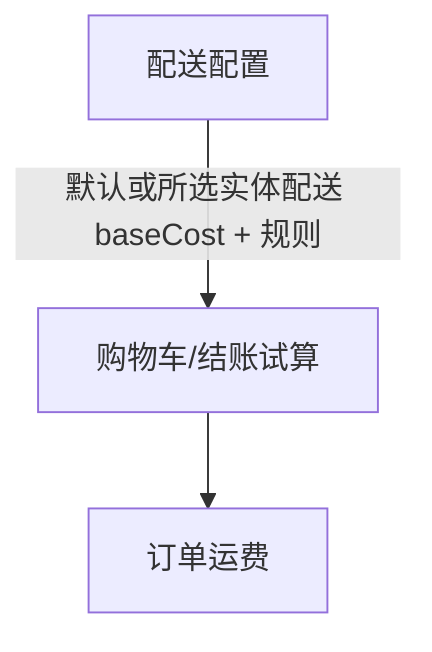

# 配送

> 菜单：**电商 → 配送**  
> 深链：`/_Admin/commerce/shippings?SiteId={站点GUID}`  
> **实体新建**：`/_Admin/commerce/shippings/create?SiteId=...`  
> **实体编辑**：`/_Admin/commerce/shippings/edit?SiteId=...&id={配送Id}`  
> **数字新建/编辑**：`/_Admin/commerce/digital-shippings/create|edit?SiteId=...`

配置结账时的 **配送方式**：实体商品走 **快递运费**（按金额/条件加价），数字商品走 **数字配送**（邮件下发交付内容）。购物车与订单合计中的 **运费** 来自此处（服务端 `SiteCommerce` / `Calculator` 试算逻辑）。

::: warning 新站默认运费（影响购物车/订单总价）
首次加载站点 Commerce 数据时，若尚无任何 **实体配送** 记录，系统会自动创建 **一条** 默认配送（`SiteCommerce.Init()`）：

| 项 | 默认值 |
|----|--------|
| 名称 | `Standard` |
| **基础运费**（`baseCost`） | **5**（与站点货币单位一致，如 USD 即为 5 美元） |
| **默认配送** | 是（`isDefault`） |

该 **5** 指 **基础运费金额**，数字商品则会自动创建默认 **Mail Delivery** 数字配送（邮件交付，基础运费为 0）。

因此新建站点后，只要购物车含 **非数字** 商品且未改配送，结账试算通常会 **加上这笔默认运费**。若需免邮或自定义规则，请在本页编辑 **Standard** 的 **基础运费**（改为 `0`）、增删配送方式，或配置 **支持国家** 与 **附加费用规则**。

:::

## 如何打开

1. 在 [编辑菜单](../navigation.md#权限与编辑菜单) 中勾选 **电商 → 配送**（及父级 **电商**）。
2. 左侧 **电商 → 配送**。

页顶为 **实体产品** / **数字产品** 两个 Tab（URL 查询参数 `name=express|digital` 可深链到对应 Tab）。

## 实体产品（快递运费）

<DocImage src="/cms/commerce/shippings-express-list.png" alt="配送：实体商品列表、默认标签与基础运费" width="1120" />

### 列表

| 列 / 操作 | 说明 |
|-----------|------|
| **名称** | 配送方式名称；**默认** 配送带「默认」标签 |
| **描述** | 可选说明，结账时展示 |
| **基础运费** | `baseCost`，以 [货币](./currencies.md) 站点默认币种显示 |
| **费用规则** | `additionalCosts` 摘要：在满足条件时追加的运费及说明 |
| **创建** | 进入新建页 |
| **编辑** | 行内铅笔进入编辑页 |
| **设为默认** | 勾选 **一行** 后，工具栏 **设为默认**（原默认会被替换；默认行不可勾选删除） |
| **批量删除** | 勾选多行 → **删除** → 确认 |

结账/购物车计价时，若未指定 `shippingId`，对 **非数字商品** 行使用 **默认** 实体配送。

### 新建与编辑

<DocImage src="/cms/commerce/shippings-express-edit.png" alt="实体配送编辑：基础运费、高级设置、附加费用规则" width="1120" />

| 区块 | 说明 |
|------|------|
| **名称 / 描述** | 必填名称；描述可选 |
| **基础运费** | 数字输入，后缀为站点 `currencyCode`；即未命中附加规则时的固定运费 |
| **高级设置**（展开） | **快递公司代码**、**运单号匹配**（正则，用于物流对接）、**支持国家**（可配置多国及预计送达天数） |
| **附加费用规则** | 点 **添加费用规则**：每条含 **费用**、**描述** 与 **订单条件**（`Condition`，字段/比较符/值，且/或）。满足条件时在基础运费上 **累加** 该条 `cost` |

## 数字产品（数字配送）

<DocImage src="/cms/commerce/shippings-digital-list.png" alt="配送：数字商品列表与默认 Mail Delivery" width="1120" />

数字商品不下实体快递费；配送方式决定 **如何把数字产品发给买家**（通常为邮件）。

### 列表

与实体列表类似：**名称**、**描述**、**设为默认**、**创建 / 编辑 / 删除**。新站默认有一条 **Mail Delivery** 且为默认。

### 新建与编辑

<DocImage src="/cms/commerce/shippings-digital-edit.png" alt="数字配送编辑：邮件服务器与邮件模板" width="1120" />

| 项 | 说明 |
|----|------|
| **名称 / 描述** | 配送方式标识 |
| **邮件服务器** | **Kooboo**（使用站点邮件地址）或 **自定义** SMTP（主机、端口、账号等） |
| **发件地址** | Kooboo 模式下从邮件模块选择 |
| **邮件模板** | 主题与正文；支持 **预览** / 编辑 **代码**（模板变量以界面为准） |
| 交付内容 | 与 [商品详情 → 数字产品](./product-management-detail.md#数字商品) 中配置的 `digitalItems` 一并构成买家收到的数字商品 |

订单创建时，数字商品订单会关联默认或指定的 `digitalShippingId`。

## 与购物车、订单的关系

| 场景 | 行为 |
|------|------|
| 购物车含实体商品 | 试算附加 **运费**；未选配送时用 **默认** 实体配送的 **基础运费 + 命中条件的附加费** |
| 仅数字商品 | 使用数字配送发信，一般不叠加实体 `baseCost` |
| 混合购物车 | 实体行按快递规则计费；数字行走数字配送流程 |
| 后台 [购物车](./carts.md) **结账** | 与前台一致，可验证运费是否含默认 **5** 单位基础费 |

调整运费后，已有购物车可能需要刷新或重新试算才能看到新金额（以实现为准）。

## 相关

- [设置](./settings.md) — 重量单位（运费计算可能参考商品重量）  
- [货币](./currencies.md) — 运费币种展示  
- [商品类型](./product-types.md) · [商品详情](./product-management-detail.md) — 数字商品与交付项  
- [购物车](./carts.md) · [订单](./orders.md)  
- [k.commerce.shipping](/api/commerce/shipping.md)
