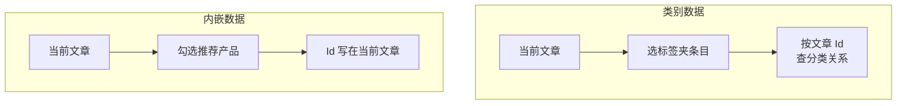

# 内容设置

> 从 [内容列表](./contents-folders-list.md) 行内 **设置**（齿轮）或 **新建** 向导打开  
> 对话框标题一般为 **设置**，含三个 Tab：**基本信息**、**关联数据**、**字段**

在此配置内容文件夹元数据、与其它内容文件夹的关联，以及后台录入/列表时的 **字段显示顺序**。不用于填写某一条目的具体字段值（那在 [内容条目](./contents-entries.md) 编辑页）。

::: tip 前置
已创建 [数据类型](./content-types.md)。关联数据只能关联到 **文件夹** 类型的其它内容文件夹（不能选「单条内容」夹）。
:::

<DocImage src="/cms/content/contents-folder-settings-basic.png" alt="内容文件夹设置：基本信息 Tab" width="960" />

## 基本信息

| 配置 | 说明 |
|------|------|
| 名称 | 内容文件夹标识，`k.content.{名称}` 中的 `{名称}`；新建后通常不可改 |
| 显示名 | 后台展示名称 |
| 预览 URL | 可选；[内容条目](./contents-entries.md)「保存并预览」等会使用 |
| 数据类型 | 绑定 [数据类型](./content-types.md)；保存后通常不可改 |
| 分页大小 | 仅 **文件夹**：条目列表每页条数，可选「禁用分页」 |
| 分组 | 在内容文件夹列表里与其它夹折叠为同一组显示 |
| 可排序 | 是否允许手动排序条目 |
| 排序字段 | 启用后：按某字段升/降序，或 **拖放排序** |
| 隐藏 | 在内容文件夹列表中隐藏（可用「显示全部」查看） |

**单条内容** 夹无分页等与列表相关的项，以界面为准。

## 关联数据

将 **其它内容文件夹** 中的数据挂到本夹每条条目上，便于后台录入和前台 `k.content` 读取。分两类：

| 类型 | 后台名称 | 数据关系 | 典型用途 |
|------|----------|----------|----------|
| **类别数据** | 类别数据 | 当前条目「属于」关联夹中的哪些条目（分类/标签式，多对多） | 文章属于多个「标签」、产品归属「分类」 |
| **内嵌数据** | 内嵌数据 | 在当前条目上 **挑选并嵌入** 关联夹中的具体条目（存 Id 列表） | 文章下的「推荐产品」列表、轮播图条目 |

二者都需配置：

| 项 | 说明 |
|----|------|
| 目标内容文件夹 | 下拉选择站点内另一 **文件夹** 型内容文件夹 |
| **别名 (alias)** | API 与模板中使用的键名，须唯一，建议英文 |
| **显示名** | 后台表单上的区块标题 |
| **多个** | 仅 **类别数据**：是否允许多选关联 |

**内嵌数据** 还可 **添加分组**：同一组内可挂多个关联夹，组名用于后台展示；别名字段在组内分别配置。

<DocImage src="/cms/content/contents-folder-settings-relation.png" alt="内容文件夹设置：关联数据 Tab" width="960" />

### 类别数据 vs 内嵌数据（怎么选）



| 问题 | 更倾向 |
|------|--------|
| 关联集由「当前条目属于哪些分类/标签」决定 | **类别数据** |
| 关联集是编辑时手动挑的一批固定条目 | **内嵌数据** |
| 需要同一区块里组合多个关联夹 | **内嵌数据** + 分组 |

---

## 在 k.content 中读取关联数据

先取得 **当前条目**（文件夹用 `.get()`，单条内容文件夹用 `k.content.{夹名}` 直读），再通过配置的 **别名** 访问。

### 类别数据（alias 示例 `tags`）

```typescript
const post = k.content.Article.get('2024-launch')

// 别名 tags：返回关联夹中、已挂到本篇文章上的条目数组
const tagItems = post.tags  // 等价于 KCategory.All()

for (const tag of tagItems) {
  k.console.log(tag.title)
}
```

### 内嵌数据（alias 示例 `relatedProducts`）

```typescript
const post = k.content.Article.get('2024-launch')

// 别名 relatedProducts：返回本篇文章内嵌的产品条目数组
const products = post.relatedProducts  // 等价于 KEmbeddedFolder.All()

for (const p of products) {
  k.console.log(p.title)
}
```

### relatedContent（按名称获取）

也可使用条目上的 **`relatedContent`** 对象，按别名调用 `get`：

```typescript
const post = k.content.Article.get('2024-launch')
const gallery = post.relatedContent.get('sideGallery')
```

未配置关联的别名访问结果为 `null` / 空。具体返回类型与是否含离线条目，以 [k.content](/api/content/) 与运行时为准。

::: tip 与 k-data
列表页展示主内容文件夹条目常用 [k-data](/templateEngine/k-data/query.md)；关联块若在条目详情页渲染，多在 KScript 中 `get` 单条后再读别名。
:::

---

## 字段

控制 **内容条目** 编辑页与相关界面中，**可编辑字段 + 关联区块** 的显示顺序（拖动排序）。

| 来源 | 说明 |
|------|------|
| 数据类型中「用户可编辑」的字段 | 来自当前夹绑定的类型 |
| 已配置的类别/内嵌关联 | 以别名或显示名出现在列表中 |

仅影响后台展示顺序，不改变字段定义本身（定义仍在 [数据类型](./content-types.md)）。

<DocImage src="/cms/content/contents-folder-settings-fields.png" alt="内容文件夹设置：字段 Tab（显示顺序）" width="960" />

保存时若基本信息或关联数据校验失败，对话框会自动切到对应 Tab。

## 相关

| 文档 | 说明 |
|------|------|
| [内容列表](./contents-folders-list.md) | 新建文件夹 / 单条内容 |
| [内容条目](./contents-entries.md) | 录入关联与字段值 |
| [k.content](/api/content/) | API 参考 |
