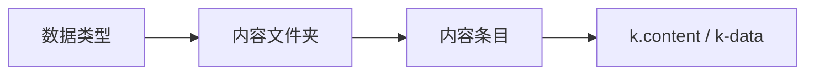

# 内容

> 菜单：左侧 **内容** 分组（部分子项需在 **高级菜单** 中开启）  
> 核心路径：`/_Admin/content/contentTypes?SiteId=...`、`/_Admin/content/contents?SiteId=...`

站点结构化数据（文章、产品说明、Banner 文案等）在后台 **内容** 模块维护，前台通过 [k.content](/api/content/) 或 [k-data](/templateEngine/k-data/query.md) 读取。

## 先理解两件事

| 概念 | 后台菜单 | 作用 |
|------|----------|------|
| **数据类型** | 内容 → **数据类型** | 定义字段模型（名称、控件类型、多语言等） |
| **内容文件夹** | 内容 → **内容** | 按类型建「文件夹」或「单条内容」，其下录入条目 |

须 **先建数据类型，再建内容文件夹**。内容文件夹的 **名称** 即 API 中的文件夹键，例如 `k.content.Article.all()` 里的 `Article`。

## 子菜单一览

| 菜单 | 路径 | 文档 | 说明 |
|------|------|------|------|
| **内容** | `/content/contents` | [内容列表](./contents-folders-list.md) 等，见下 |
| **数据类型** | `/content/contentTypes` | [数据类型](./content-types.md) | 字段模型 |
| **标签** | `/content/labels` | [标签](./labels.md) | 多语言文案，`k.label` / `k.t` |
| HTML 片段 | `/content/htmlblocks` | 待写 | 可复用 HTML 块 |
| 文件 | `/content/files` | 待写 | 站点文件（高级菜单） |
| 标签属性 | `/content/text` | 待写 | 标签属性（高级菜单） |
| 参数配置 | `/content/useroptions` | 待写 | 用户可编辑参数（高级菜单） |

::: tip 与媒体库、页面
- 字段类型为 **图片** 时，值通常来自 [媒体库](/cms/site/media.md)。  
- **预览 URL** 常指向 [页面](/cms/site/pages.md) 路由，用于后台预览或前台详情页。
:::

## 内容文件夹文档

| 文档 | 说明 |
|------|------|
| [内容列表](./contents-folders-list.md) | 新建 **文件夹** / **单条内容**、`k.content` 用法差异 |
| [内容设置](./contents-folder-settings.md) | 设置弹窗：基本信息、**关联数据**、字段 |
| [内容条目](./contents-entries.md) | 条目列表、新建/编辑、保存与预览 |

## 典型建站顺序

1. [数据类型](./content-types.md) — 例如 `Article`：标题、正文、封面图、日期。  
2. [内容列表](./contents-folders-list.md) — 新建文件夹 `Article`，在 [设置](./contents-folder-settings.md) 中配好关联（如需）。  
3. [内容条目](./contents-entries.md) — 新建并保存条目。  
4. 模板中用 `k-data` 或 KScript 读取，见 [k.content API](/api/content/)。

## 相关

| 文档 | 说明 |
|------|------|
| [k.content](/api/content/) | 脚本 CRUD、查询运算符 |
| [k-data 与 query](/templateEngine/k-data/query.md) | 模板列表与筛选 |
| [站点后台菜单总览](../navigation.md) | 完整菜单树 |
