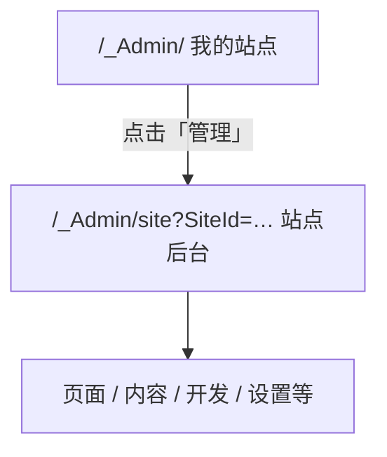

# 登录与站点列表

> 从控制台首页进入 Kooboo：**我的站点**、文件夹整理、进入某一站点的后台

本文描述 **账户级** 界面（地址栏一般**没有** `SiteId`）。进入某个站点后的菜单见 [站点后台菜单总览](../navigation.md)。

## 入口地址

| 场景 | 地址（示例主机为 redev.cn） |
|------|-----------------------------|
| 控制台根路径 | `https://www.redev.cn/_Admin/` |
| 登录（未登录时会被跳转） | `https://www.redev.cn/_Admin/login` |
| 某文件夹下的站点列表 | `https://www.redev.cn/_Admin/?currentFolder={文件夹名}` |

Kooboo 将前端构建在 `/_Admin/` 下；换域名时把 `www.redev.cn` 换成你的控制台域名即可。

## 登录
<DocImage src="/cms/getting-started/01-login.png" alt="Kooboo 登录页：账号密码与其他登录方式" width="1120" />

1. 浏览器打开 `/_Admin/`。
2. 若会话未登录，会进入 **登录** 页（支持账号密码、手机登录等，以界面为准）。
3. 登录成功后进入 **我的站点** 首页。

## 我的站点首页
<DocImage src="/cms/getting-started/站点列表.png" alt="Kooboo 登录页：账号密码与其他登录方式" width="1120" />

登录后默认页面标题为 **我的站点**，主要区域包括：

### 顶部操作

| 按钮 | 作用 |
|------|------|
| **新建站点** | 进入创建站点向导（见 [新建站点](./create-site.md)） |
| **新建文件夹** | 在列表中增加文件夹，用于归类多个站点（仅在「全部站点」视图显示） |

::: info 关于「AI 制作」
首页另有 **AI 制作** 入口，用于 AI 建站流程。本系列文档暂不展开；日常实施建议从 **新建站点 → 空白站点** 开始。
:::

### 搜索与视图

- **搜索站点**：按站点名称筛选。
- **列表 / 网格**：切换展示方式。网格视图下文件夹以卡片形式出现在站点卡片上方；列表视图下文件夹与站点可在同一表格中浏览。

### 文件夹

文件夹用于在账号下分组管理站点，**不改变站点本身的数据**，仅影响首页展示与归类。

| 操作 | 说明 |
|------|------|
| 进入文件夹 | 点击文件夹卡片或列表中的文件夹行；地址栏会出现 `?currentFolder=文件夹名` |
| 返回全部站点 | 点击面包屑中的 **所有站点**，或去掉地址栏中的 `currentFolder` 参数 |
| 新建文件夹 | 点击 **新建文件夹**，输入名称 |
| 重命名 / 删除 | 文件夹卡片或列表行上的 **更多操作** |

在文件夹内：

- 仅显示该文件夹下的站点；
- 仍可 **新建站点**，新建成功后会自动归入当前文件夹（若你是在文件夹内点的「新建站点」）。

<DocImage src="/cms/getting-started/02-site-list-folders.png" alt="我的站点：进入某一文件夹后的列表（空文件夹示例）" width="1120" />

::: tip
上图以空文件夹为例；有站点时同一位置会显示站点卡片，操作方式相同。
:::

### 站点卡片 / 列表行

每个站点通常展示预览图、名称、在线状态等。常用操作：

| 操作 | 说明 |
|------|------|
| **管理** | 进入该站点的后台（控制面板）；地址变为 `/_Admin/site?SiteId={站点GUID}` |
| **分享** | 生成协作或预览相关链接（以对话框为准） |
| **更多操作** | 导出站点包、移动到文件夹、删除等 |

进入站点后台后，左侧才会出现 [内容 / 开发 / 电商 / 站点设置](../navigation.md) 等菜单；站点列表页本身没有这些菜单。

<DocImage src="/cms/getting-started/03-enter-site.png" alt="点击「管理」后进入的站点控制面板（含左侧菜单）" width="1120" />

### 批量操作（列表视图）

勾选多个站点后，可进行 **导出**、**移动到文件夹**、**删除**（权限允许时）。

## 两层后台，不要混淆

| 层级 | 典型 URL | 文档 |
|------|----------|------|
| 账户级 | `/_Admin/`、`/_Admin/create` | 本文、[新建站点](./create-site.md) |
| 站点级 | `/_Admin/site/pages?SiteId=…` 等 | [菜单总览](../navigation.md) |
