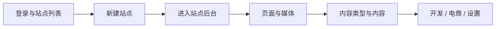

# Kooboo 后台（CMS）

> 在 Kooboo 控制台中配置站点、内容与集成——面向管理员与实施人员

## 这篇文档解决什么问题

你可能已经看过 [模板引擎](/templateEngine/) 或 [KScript API](/api/)，但不确定**在后台先点哪里**。本系列按 Kooboo 站点后台的真实菜单，说明配置步骤，并链到开发文档。

::: tip 菜单以产品为准
侧边栏结构来自 Kooboo 前端工程（`Frontend/src/router/site.ts`）。产品升级后若菜单有变，以你登录后的界面为准；我们也会随版本更新本文档。
:::

## 建议学习顺序

文档从 **控制台外层**（登录、站点列表）写到 **某一站点内部**（页面、内容、开发、设置）。



| 阶段 | 文档 | 你将完成 |
|------|------|----------|
| 0 | [登录与站点列表](./getting-started/login-and-site-list.md) | 登录、文件夹、进入「管理」 |
| 1 | [新建站点](./getting-started/create-site.md) | 空白 / 导入 / 克隆（不含 AI 制作） |
| 2 | [站点后台菜单总览](./navigation.md) | 知道 `SiteId` 下功能在哪一栏 |
| 3 | 页面、媒体（待写） | 创建可访问的页面 |
| 4 | [数据类型与内容](./content/data-types.md) | 为 `k.content` 准备数据 |
| 5 | 开发菜单（待写） | Layout、View、Script，见 [模板引擎](/templateEngine/) |
| 6 | 服务集成（待写） | 支付、短信、JWT 等 |

## 与开发文档的关系

| 你在后台做 | 接下来看 |
|------------|----------|
| 建内容类型、内容夹 | [k.content](/api/content/) |
| 建 Layout / Page / View | [模板引擎](/templateEngine/) |
| 配微信支付、支付宝 | [k.payment](/api/payment/) |
| 开多语言、维护 Label | [k.label](/api/label/) · [模板绑定](../templateEngine/binding/) |

## 两类地址

| 层级 | 何时使用 | 示例 |
|------|----------|------|
| **账户级** | 站点列表、新建站点 | `https://www.redev.cn/_Admin/`、`/_Admin/create` |
| **站点级** | 已进入某一站点后台 | `/_Admin/site/pages?SiteId={站点GUID}` |

站点级深链统一写成：

```text
/_Admin{路径}?SiteId={你的站点ID}
```

详见 [菜单总览](./navigation.md)。

## 文档怎么配图

重要步骤会配图（仓库 `docs/public/cms/...`，文中 `/cms/...`）。截图未齐时，以**菜单路径 + 步骤文字**为准仍可完成操作。约定见仓库 `.trellis/spec/documentation-images.md`。

## 相关

- [登录与站点列表](./getting-started/login-and-site-list.md)
- [新建站点](./getting-started/create-site.md)
- [菜单总览](./navigation.md)
- [内容：数据类型](./content/data-types.md)
