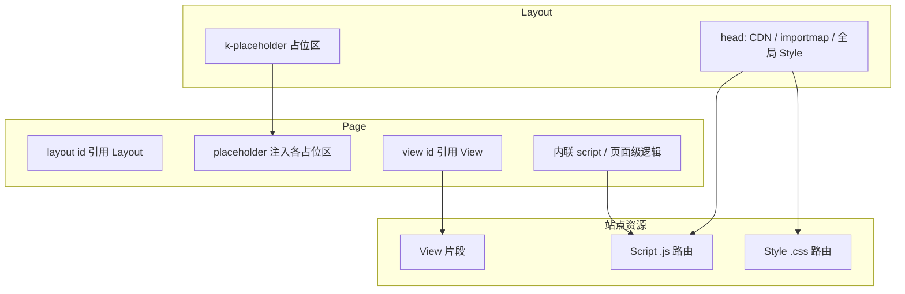

# 模板引擎

> Kooboo 站点前端：页面、布局、视图与静态资源如何组织与渲染

## 概述

在 Kooboo 中，**可访问的 HTML 页面**由 **Page** 定义；**Layout** 提供整站共用的 HTML 骨架（`<head>`、导航、占位区）；**View** 是可复用的 HTML 片段；**Script** / **Style** 是带路由的独立 `.js` / `.css` 资源，供布局或页面引用。

服务端数据与 DOM 绑定使用 **`env="server"`** 与 `k-content`、`k-for` 等指令（见 [模板绑定语法](./binding/)）。声明式数据查询使用 **[k-data](./k-data/)**（替代已弃用的 `k-query`）。

## 资源关系

| 资源 | 典型职责 | 是否有 URL 路由 |
|------|----------|-----------------|
| [Layout](./layout/) | 整页骨架、`k-placeholder` | 否 |
| [Page](./page/) | 路由页面、选择布局、填占位 | 是 |
| [View](./view/) | Header、卡片、列表等复用块 | 否 |
| [Script](./js/) | 可 `import` 的 JS、前端交互 | 是 |
| [Style](./css/) | 全局或页面样式表 | 是 |

## 文档导航

| 主题 | 说明 |
|------|------|
| [Layout](./layout/) | `k-placeholder`、多栏布局 |
| [Page](./page/) | 独立页 vs `<layout>` + `<placeholder>` |
| [View](./view/) | `<view id="...">`、拆分原则 |
| [Script](./js/) | 站点 JS 资源、`type="module"` |
| [Style](./css/) | 站点 CSS、与 Tailwind 等配合 |
| [模板绑定语法](./binding/) | `env="server"`、`k-content`、`k-for` 等 |
| [k-data](./k-data/) | `<k-data>`、`<query>`、JSON5 条件 |

## 与 KScript API 的分工

| 场景 | 文档位置 |
|------|----------|
| 在 **HTML 模板** 里写布局、占位、视图引用 | 本目录 `templateEngine/*` |
| 用 **`k.site.pages`** 等 **脚本** 增删改资源 | [k.site](/api/site/) |
| 输出 **站点导航菜单**（`<menu>` 或 `k.site.menus` + `k-for`） | [k.site.menus](/api/site/menu.md) · [CMS：菜单](/cms/development/menus) |
| 调用 **外部 OpenAPI** 服务 | [k.openApi](/api/openapi/) · [CMS：Open API](/cms/development/openapis) |
| **SPA** 前端拉取 JSON 词典 | [SPA 多语言 API](/api/spa-multilingual/) · [CMS](/cms/development/spa-multilingual) |
| **可安装模块**（路由、view/api） | [k.module](/api/module/) · [CMS：模块](/cms/development/modules) |
| **计划任务** | [k.site · 任务](/api/site/job.md) · [CMS：任务](/cms/development/jobs) |
| 改 **当前请求** 的 title/meta | [k.page](/api/page/) |

## 数据查询

- [k-data](./k-data/) — 声明式数据（`let` / `query` / `map` / `export`）
- 历史 `k-query` 已弃用；旧 URL 会重定向到 k-data
